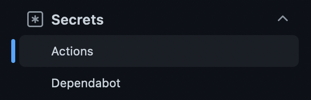

# GitHub Actions with Java, Gradle, Docker, SSH.

### 1. Introduction
In this tutorial, I'll show you how build your app with the Gradle, push a docker-image of it on the Docker Hub and
deployment it on your server with CI/CD GitHub Actions.

### 2. Overview
GitHub Actions is a continuous integration and continuous delivery (CI/CD) platform 
that allows you to automate your build, test, and deployment pipeline.

Workflows are defined by a YAML file checked in to your repository and will run when triggered by an event in your repository
and a repository can have multiple workflows, each of which can perform a different set of tasks.
But in this tutorial we will use one workflow with all steps which we need.

### 3. Let's start 
Create your workflow file `some-workflow.yml` in the `.github/workflows` directory in the root path of your app:


The content of `some-workflow.yml`:
```yaml
on:
  push:
    branches:
    - master

name: learn-github-actions

jobs:
  deploy:
    name: Build and Deploy
    runs-on: ubuntu-latest
    environment: production

    steps:
    - uses: actions/checkout@v3
    - name: Set up JDK 17
      uses: actions/setup-java@v3
      with:
        java-version: '17'
        distribution: 'adopt'
        
    - name: Build with Gradle
      run: ./gradlew build -x test

    - name: Login to Docker Hub
      uses: docker/login-action@v1
      with:
        username: ${{ secrets.DOCKER_HUB_USERNAME }}
        password: ${{ secrets.DOCKER_HUB_ACCESS_TOKEN }}

    - name: Set up Docker Buildx
      uses: docker/setup-buildx-action@v1

    - name: Build and push
      id: docker_build
      uses: docker/build-push-action@v3
      with:
        context: ./
        file: ./Dockerfile
        push: true
        tags: ${{ secrets.DOCKER_HUB_APP_TAG }}

    - name: Image digest
      run: echo ${{ steps.docker_build.outputs.digest }}

    - name: SSH connect with running scripts
      uses: appleboy/ssh-action@master
      with:
        host: ${{ secrets.SERVER1_HOST }}
        key: ${{ secrets.SERVER1_PRIVATE_KEY }}
        username: ${{ secrets.SERVER1_SSH_USER }}
        script: |
          cd /home
          docker compose pull some-api
          docker compose up -d some-api
```

- Push event. It has a branches filter that causes your workflow to run only when 
a push to a branch that matches the branches filter occurs, instead of when any push occurs.
```yaml
on:
  push:
    branches:
    - master
```

- The name of the workflow.
```yaml
name: learn-github-actions
```

- Groups together all the jobs that run in the learn-github-actions workflow.

```yaml
  deploy:
    name: Build and Deploy
    runs-on: ubuntu-latest
    environment: production
```

- Groups together all the steps.
Each item nested under this section is a separate action or shell script.
```yaml
    steps:
```

- This action checks-out your repository, so your workflow can access it.
[For details](https://github.com/actions/checkout)
```yaml
    - uses: actions/checkout@v3
```

- Extracting and caching custom version of Java from a local file.
[For details](https://github.com/actions/setup-java)
```yaml
    - name: Set up JDK 17
      uses: actions/setup-java@v3
      with:
        java-version: '17'
        distribution: 'adopt'
```

- Executes a Gradle build.
[For details](https://docs.github.com/en/actions/automating-builds-and-tests/building-and-testing-java-with-gradle)
```yaml
    - name: Build with Gradle
      run: ./gradlew build
```

- This action to log in against a Docker registry. [For details](https://github.com/docker/login-action)

  Secrets are encrypted environment variables that you create in an organization, repository, or repository environment.
  [For details](https://docs.github.com/en/actions/security-guides/encrypted-secrets)





```yaml
    - name: Login to Docker Hub
      uses: docker/login-action@v1
      with:
        username: ${{ secrets.DOCKER_HUB_USERNAME }}
        password: ${{ secrets.DOCKER_HUB_ACCESS_TOKEN }}
```
- This action to set up Docker [Buildx](https://github.com/docker/buildx). (Docker CLI plugin)
```yaml
    - name: Set up Docker Buildx
      uses: docker/setup-buildx-action@v1
```
- The action to build and push Docker images. [For details](https://github.com/docker/build-push-action)

  You have to assume you have a Dockerfile in your project root. `DOCKER_HUB_APP_TAG` - the tag of your docker-image.
```yaml
    - name: Build and push
      id: docker_build
      uses: docker/build-push-action@v3
      with:
        context: ./
        file: ./Dockerfile
        push: true
        tags: ${{ secrets.DOCKER_HUB_APP_TAG }}
```

- Enables of workflow command. [For details](https://docs.github.com/en/actions/using-workflows/workflow-commands-for-github-actions#echoing-command-outputs)
```yaml
    - name: Image digest
      run: echo ${{ steps.docker_build.outputs.digest }}
```
- This action for executing remote ssh commands. [For details](https://github.com/appleboy/ssh-action)

  `host` - ssh host

  `key` - content of ssh private key. ex raw content of ~/.ssh/id_rsa

  `username` - ssh username

  `script` - execute commands. In this example we can pull and up a app with docker compose (pre-installed on the server)
  
```yaml
    - name: SSH connect with running scripts
      uses: appleboy/ssh-action@master
      with:
        host: ${{ secrets.SERVER1_HOST }}
        key: ${{ secrets.SERVER1_PRIVATE_KEY }}
        username: ${{ secrets.SERVER1_SSH_USER }}
        script: |
          cd /home
          docker compose pull some-api
          docker compose up -d some-api
```

Thanks for reading!